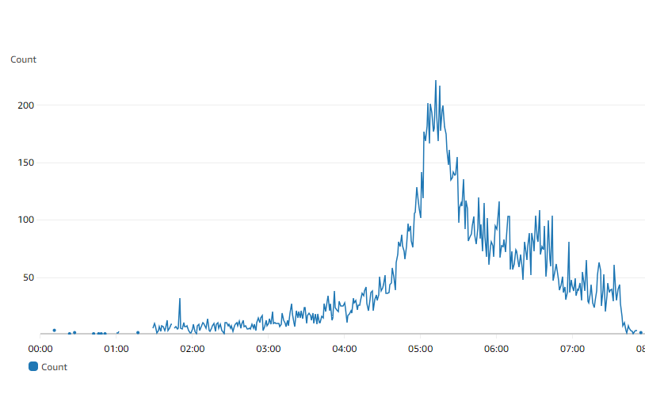

# tracking-id

Upwork gig for a client. Lambda to track IP of the user, save in DB and redirect to a URL. DB is also on AWS, chosen AWS Aurora serverless V2 so that it can autoscale. Also used API gateway for exposing the endpoints which were attached to Lambda. Could have used Lambda URL as well but then we won't be able to extract the IP of the user. API gateway context provide IP of the user consuming the endpoint.

Major requirement was to handle peak traffic of 500 users per sec.

